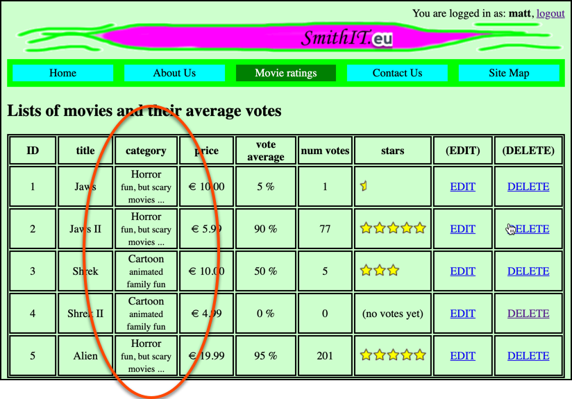

# evote-movie-2020-27-movie-category-many-to-one

Let's create a new Entity class `Category`, for the type of movie (sci-fi, horror, cartoon etc.). We can then link each `Movie` object to a `Category` object.



- create new Entity class `Category`, we'll have a name field, and a description, so we can have a sentence about each one. Plus we need to generate getters and setters for all fields, and the SQL to create a new DB table for these objects:
    
    ```php
    <?php
    namespace Tudublin;
    
    class Category
    {
        const CREATE_TABLE_SQL =
            <<<HERE
        CREATE TABLE IF NOT EXISTS category (
            id integer PRIMARY KEY AUTO_INCREMENT,
            name text,
            description text
        )
        HERE;
    
        private $id;
        private $name;
        private $description;
    
        ... plus GETTERS and SETTERS for all properties as ussual ...
    ```
  
- we also need to create a corresponding repository class `CategoryRepository`:

    ```php
    <?php
    namespace Tudublin;
    
    use Mattsmithdev\PdoCrudRepo\DatabaseTableRepository;
    
    class CategoryRepository extends DatabaseTableRepository
    {
    
    }
    ```
  
- we can now write a migration and fixture script to setup the table and insert some initial data. Create file `db/categoryMigrationAndFixtures.php`:

    ```php
        <?php
        require_once __DIR__ . '/../vendor/autoload.php';
        
        use Tudublin\Category;
        use Tudublin\CategoryRepository;
        
        $categoryRespository = new CategoryRepository();
        
        // (1) drop then create table
        $categoryRespository->dropTable();
        $categoryRespository->createTable();
        
        // (2) delete any existing objects
        $categoryRespository->deleteAll();
        
        // (3) create objects
        $c1 = new Category();
        $c1->setId(1);
        $c1->setName('Horror');
        $c1->setDescription('fun, but scary movies ...');
        
        $c2 = new Category();
        $c2->setId(2);
        $c2->setName('Cartoon');
        $c2->setDescription('animated family fun');
        
        
        // (4) insert objects into DB
        $categoryRespository->create($c1);
        $categoryRespository->create($c2);
    ```

- to link a `Movie` object to a `Category` object, we need to store the ID of the `Category` in the `Movie` object. So let's refactor our `Movie` entity class to store `categoryID` rather than a text `category`. We need to update the SQL, private properties, and getters/setters for class `Movie`:

```php
<?php
namespace Tudublin;

class Movie
{
    const CREATE_TABLE_SQL =
        <<<HERE
CREATE TABLE IF NOT EXISTS movie (
    id integer PRIMARY KEY AUTO_INCREMENT,
    title text,
    categoryId text,
    price float,
    voteTotal integer,
    numVotes integer
)
HERE;

    private $id;
    private $title;
    private $categoryId;
    private $price;
    private $voteTotal;
    private $numVotes;

    ... plus getters/setters ...
```

- just as we did for the `Comment` class previously with the `getUser()` method, we should add a `getCategory()` method to our `Movie` class. So if we have a `Movie` object, we can easily get a reference to its related `Category` object. Add this method to the `Movie` class:

    ```php
    public function getCategory()
    {
        // if not NULL id, then find and return associated user
        if(!empty($this->categoryId)){
            $categoryRepository = new CategoryRepository();
            return $categoryRepository->find($this->categoryId);
        }
    
        // if id NULL, then return NULL
        return null;
    }
    ```

- we need to add this new migration-fixtures file to those executed by our `db/resetDatabase.php` script:

    ```php
    <?php
    
    require_once __DIR__ . '/../vendor/autoload.php';
    
    use Tudublin\DotEnvLoader;
    
    // load DB constants from DOTENV
    $dotEnvLoader = new DotEnvLoader();
    $dotEnvLoader->loadDBConstantsFromDotenv();
    
    require_once __DIR__ . '/userMigrationAndFixtures.php';
    require_once __DIR__ . '/movieMigrationAndFixtures.php';
    require_once __DIR__ . '/commentMigrationAndFixtures.php';
    require_once __DIR__ . '/categoryMigrationAndFixtures.php';
    ```

- we need to now refactor our Movie migration-fixtures script. Since we know, from our fixtures, that the **horror** category has ID=1, and the **cartoon** category has ID=2, we can use these values to link new `Movie` objects to `Category` objects. Update DB setup script 
`db/movieMigrationAndFixtures.php` to the following:
    
    ```php
    <?php
    require_once __DIR__ . '/../vendor/autoload.php';
    
    use Tudublin\Movie;
    use Tudublin\MovieRepository;
    
    $movieRespository = new MovieRepository();
    
    // (1) drop then create table
    $movieRespository->dropTable();
    $movieRespository->createTable();
    
    // (2) delete any existing objects
    $movieRespository->deleteAll();
    
    // give Category IDs meaningful names
    $categoryHorror = 1;
    $categoryCartoon = 2;
    
    // (3) create objects
    $m1 = new Movie();
    $m1->setId(1);
    $m1->setTitle('Jaws');
    $m1->setCategoryId($categoryHorror);
    $m1->setPrice(10.00);
    $m1->setVoteTotal(5);
    $m1->setNumVotes(1);
    
    $m2 = new Movie();
    $m2->setId(2);
    $m2->setTitle('Jaws II');
    $m2->setCategoryId($categoryHorror);
    $m2->setPrice(5.99);
    $m2->setVoteTotal(77 * 90);
    $m2->setNumVotes(77);
    
    $m3 = new Movie();
    $m3->setId(3);
    $m3->setTitle('Shrek');
    $m3->setCategoryId($categoryCartoon);
    $m3->setPrice(10);
    $m3->setVoteTotal(5 * 50);
    $m3->setNumVotes(5);
    
    $m4 = new Movie();
    $m4->setId(4);
    $m4->setTitle('Shrek II');
    $m4->setCategoryId($categoryCartoon);
    $m4->setPrice(4.99);
    $m4->setVoteTotal(0);
    $m4->setNumVotes(0);
    
    $m5 = new Movie();
    $m5->setId(5);
    $m5->setTitle('Alien');
    $m5->setCategoryId($categoryHorror);
    $m5->setPrice(19.99);
    $m5->setVoteTotal(95 * 201);
    $m5->setNumVotes(201);
    
    // (4) insert objects into DB
    $movieRespository->create($m1);
    $movieRespository->create($m2);
    $movieRespository->create($m3);
    $movieRespository->create($m4);
    $movieRespository->create($m5);
    
    //// (5) test objects are there
    $movies = $movieRespository->findAll();
    print '<pre>';
    var_dump($movies);
    ```

- We need to update the Twig to display movies, so that the `name` of the `Category` object associated with each `Movie` is displayed in the table by Twig template `list.html.twig`:
    
    ```twig
    ... as before ...
    
        
        <tr>
            <td>{{ movie.id }}</td>
            <td>{{ movie.title }}</td>
            <td>
                {{ movie.category.name }}
            <br>
                <small>{{ movie.category.description }}</small>
            </td>
            <td>&euro; {{ movie.price | number_format(2, '.', ',') }}</td>
            <td>{{ movie.voteAverage }} %</td>
            <td>{{ movie.numVotes }}</td>
    
    ... as before ...
    ```
  
    - by writing `movie.category` we are invoking the `getCategory()` method of the `Movie` class, giving us a reference to the `Category` object with the ID stored in the Movie's `categoryId` property 
    
    - we demonstrate that we are getting properties from a `Category` object by also displaying the `description` text for each `Category` in  a `<small>` font
    
- since we have a form to create new movies, we need to udpate that to input a `categoryId` rather than just text. Update `templates/newMovieForm.html.twig` to the following:
    
    ```twig
    
    
    new movie
    
    
        
        
        
    
        
            
            
            
        
    
    
        
            <div  class="error">
                <ul>
                    
                        <li>{{ error }}</li>
                    
                </ul>
            </div>
        
    
        <h1>
            New Movie
        </h1>
    
        <form action="/" method="post">
            <input type="hidden" name="action" value="processNewMovie">
    
            <p>
                Title:
                <input name="title" value="{{ title }}">
            <p>
                CategoryId:
                <input name="categoryId" value="{{ categoryId }}">
            <p>
                Price:
                <input name="price" value="{{ price }}">
            <p>
                <input type="submit">
        </form>
    
    
    ```
    
- we need to update the new movie processing script too. Update method `processNewMovie()` in class `MovieController`:

    ```php
    public function processNewMovie()
    {
        $title = filter_input(INPUT_POST, 'title');
        $categoryId = filter_input(INPUT_POST, 'categoryId');
        $price = filter_input(INPUT_POST, 'price');
 
    
        $movie = new Movie();
        $movie->setTitle($title);
        $movie->setCategoryId($categoryId);
        $movie->setPrice($price);
        $movie->setVoteTotal(0);
        $movie->setNumVotes(0);
    
        $errors = $this->validateMovie($movie);
    
        if(!empty($errors)){
            // invoke create form again - passing movie object and error array
            $this->createForm($errors, $movie);
    
        } else {
            // add movie to DB & list movies
            $this->movieRepository->create($movie);
            $this->listMovies();
        }
    }
    ```

- we also need to update our validation method, since `categoryId` must be a numbe. Update `MovieController` method `validateMovie(...)`as follows:

    ```php
    private function validateMovie(Movie $movie)
    {
        $errors = [];
    
        // title
        if(empty($movie->getTitle())){
            $errors[] = "title :: must have a value";
        } else {
            if(strlen($movie->getTitle()) < 3) {
                $errors[] = "title :: must have at least 3 characters";
            }
        }
    
        // category
        if(empty($movie->getCategoryId())) {
            $errors[] = "category :: must have a value";
        } else {
            if(!is_numeric($movie->getCategoryId())) {
                $errors[] = "category :: must be a number";
            }
        }
        
        // price
        if(empty($movie->getPrice())) {
            $errors[] = "price :: must have a value";
        } else {
            if(!is_numeric($movie->getPrice())) {
                $errors[] = "price :: must be a number";
            }
        }
    
        return $errors;
    }
    ```

NOTE: The same changes need to be made to the `Movie` edit form and processing method:

    - `templates/editMovieForm.html.twig`
    - `MovieController` method `processUpdateMovie`

NOTE: It is not a good idea to ask users to enter the IDs of objects - a later version of the project will offer users a drop-down list of categories to choose from, and insert the appropriate integer into the `Movie` objects `categoryId` property ...
